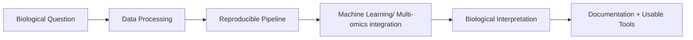

### Computational Biologist | Cancer Epigenomics & Multi-Omics

I'm a Postdoctoral Research Fellow at **Florida Atlantic University**, working across DNA methylation, single-cell genomics, and liquid biopsy to turn multi-omics data into biologically meaningful, reproducible findings. My PhD is in Computer Science (Amrita Vishwa Vidyapeetham, 2021), so I sit at the intersection of the biology itself and the pipeline engineering that makes multi-omics data usable at scale.

I'm now looking to bring that same rigor into industry: biotech, pharma, or an AI/genomics company building the next generation of multi-omics or diagnostic tools.

---

## 🔬 What I Work On

I am especially interested in roles where I can contribute to:

- Bioinformatics and computational biology software
- Genomics, transcriptomics, and spatial omics workflows
- Machine learning for biological or healthcare data
- Research software engineering and reproducible scientific computing
- Cloud/HPC-based analysis pipelines
- Genomic foundation models

---

## 🎓 Background

- 🔬 Postdoctoral Research Fellow, **Florida Atlantic University**
- 🔬 Former Postdoctoral Researcher, **Purdue University**
- 🎓 Ph.D., Computer Science, Amrita Vishwa Vidyapeetham (2021)
- 🏆 Former PI, **NIH NCATS award**
- 🌊 **Nextflow Ambassador**

---

## 🧰 Technical Toolkit

**Languages:**

**Environments, IDEs, and Ecosystems:**

**Version Control:**

---

## ⚙️ Tool Development & Pipelines

| Project | Description |
| --- | --- |
| [**ImmunoFusionGCT**](https://github.com/Nikhila123456/ImmunoFusionGCT) | Multi-modal pipeline fusing bulk RNA-seq, scRNA-seq, spatial transcriptomics/proteomics, and pathology images for tumor microenvironment and immunotherapy response prediction *(in development)* |
| [**ATAC-Seq-Peak-CNN**](https://github.com/Nikhila123456/ATAC-Seq-Peak-CNN) | scBasset-inspired CNN for predicting chromatin accessibility (ATAC-seq peaks) directly from DNA sequence |
| [**Single-cell-RNA-Sequencing**](https://github.com/Nikhila123456/Single-cell-RNA-Sequencing) | End-to-end scRNA-seq workflow covering QC, clustering, cell type annotation, and visualization |
| [**Bulk-RNA-Seq-anlaysis**](https://github.com/Nikhila123456/Bulk-RNA-Seq-anlaysis) | Reproducible bulk RNA-seq processing and differential expression pipeline |
| [**A-Computational-Framework-to-Identify-Cross-Association-between-Complex-Disorders-by-Protein-Protein**](https://github.com/Nikhila123456/A-Computational-Framework-to-Identify-Cross-Association-between-Complex-Disorders-by-Protein-Protein) | Identifies key genes and shared biological pathways across complex disorders using PPI network analysis |
| [**Topology-Driven-Analysis-of-Protein---Protein-Interactome-for-Prioritizing-Key-Comorbid-Genes-via-Su**](https://github.com/Nikhila123456/Topology-Driven-Analysis-of-Protein---Protein-Interactome-for-Prioritizing-Key-Comorbid-Genes-via-Su) | Prioritizes comorbid genes using interactome topology and network propagation (random walk with restart) |

---

## 🚀 Featured Projects

### 1. ImmunoFusionGCT: Multi-Modal Tumor Microenvironment Atlas & Immunotherapy Response Predictor *(flagship, in development)*
A production-style pipeline fusing bulk RNA-seq, scRNA-seq, spatial transcriptomics/proteomics, and H&E pathology images to stratify patients by immune microenvironment and predict treatment response.

**Tech:** `Nextflow` `Scanpy/Seurat` `Squidpy` `pathology foundation model embeddings` `graph/attention fusion` `Docker`

[View Repository](https://github.com/Nikhila123456/ImmunoFusionGCT) *(coming soon)*

---

### 2. ATAC-Seq-Peak-CNN
A scBasset-inspired convolutional neural network that predicts chromatin accessibility (ATAC-seq peaks) directly from DNA sequence.

**Tech:** `Python` `PyTorch` `regulatory genomics` `CNNs`

[View Repository](https://github.com/Nikhila123456/ATAC-Seq-Peak-CNN)

---

### 3. Single-Cell RNA Sequencing Analysis
End-to-end scRNA-seq analysis workflow, covering QC, clustering, cell type annotation, and visualization.

**Tech:** `Seurat` `R` `single-cell RNA-seq` `cluster annotation`

[View Repository](https://github.com/Nikhila123456/Single-cell-RNA-Sequencing)

---

### 4. Bulk RNA-Seq Analysis Pipeline
A reproducible bulk RNA-seq processing and differential expression workflow, from raw counts through pathway-level interpretation.

**Tech:** `Shell` `DESeq2` `bulk RNA-seq` `differential expression`

[View Repository](https://github.com/Nikhila123456/Bulk-RNA-Seq-anlaysis)

---

### 5. Cross-Disease Association via Protein-Protein Interaction Networks
Identified key genes and shared biological pathways across complex disorders using PPI network topology.

**Tech:** `network biology` `PPI` `comorbidity analysis`

[View Repository](https://github.com/Nikhila123456/A-Computational-Framework-to-Identify-Cross-Association-between-Complex-Disorders-by-Protein-Protein)

---

### 6. Topology-Driven Prioritization of Comorbid Genes
Used interactome topology and network propagation (random walk with restart) to prioritize key genes shared between comorbid diseases.

**Tech:** `network topology` `gene prioritization` `random walk with restart`

[View Repository](https://github.com/Nikhila123456/Topology-Driven-Analysis-of-Protein---Protein-Interactome-for-Prioritizing-Key-Comorbid-Genes-via-Su)

---

## 📌 Why Recruiters Should Reach Out

- **Domain depth, not just tooling**
- **True multi-omics range**
- **Production engineering mindset**
- **Independent research leadership**
- **Cross-border readiness**

---

## 🤝 Let's Connect

- GitHub: [github.com/Nikhila123456](https://github.com/Nikhila123456)
- LinkedIn: [linkedin.com/in/nikhila-t-suresh](https://www.linkedin.com/in/nikhila-t-suresh/)
- Email: tonikhila@gmail.com

---

Thanks for stopping by. I'm always up for a conversation about multi-omics integration, computational biology, or building AI tools that make it into a real industry pipeline.
